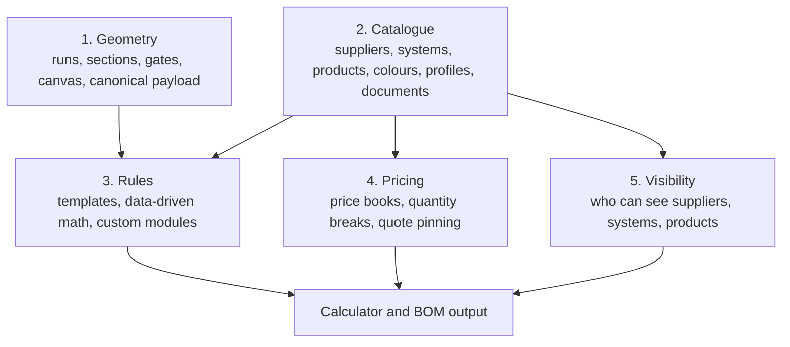

# Multi-Supplier Platform Architecture

Canonical architecture reference for evolving this app from a Glass Outlet calculator into a multi-supplier catalogue platform with calculators on top.

## Decision

I agree with the direction in the supplied architecture files: the long-term product should be a catalogue platform first, with BOM calculators as consumers of catalogue, rule, pricing, and visibility data.

The important adjustment for this repo is that we should not paste the downloaded Brief 030 SQL literally. This repo already has:

- `products`, `product_components`, `pricing_rules`, and v3 rule-engine tables.
- A primary server-side `supabase/functions/bom-calculator` engine.
- JSON-authoritative product seeds under `supabase/seeds/glass-outlet/products/`.
- Migration numbers `030` and `031` already used for other app work.

So the architecture is adopted, but future implementation briefs must extend the existing schema instead of creating a second conflicting catalogue model.

## Five Layers

## What Stays In Code

- Authentication, session handling, route guards, and RLS policy logic.
- Canvas behavior, drawing tools, geometry editing, and canonical payload adapters.
- Generic form rendering and generic BOM table rendering.
- Quote save/load/export/print workflows.
- The rule evaluator framework and any custom algorithm modules.
- Regression tests and smoke tests.

## What Moves Into Data

- Suppliers and supplier metadata.
- Systems and product families.
- Product components/SKUs, dimensions, profiles, finishes, colours, heights, widths, and accessories.
- Component diagrams, catalogue page references, install guides, and spec-sheet metadata.
- BOM rules where they are formulaic enough to be represented safely in seed data.
- Compatibility relationships such as which gates fit which fence systems.
- Warnings, assumptions, suggested add-ons, and supplier verification notes.
- Pricing and price-book history.
- Visibility and readiness status.

## Current Repo Reality

The current production path is server-first:

- `src/pages/CalculatorV3Page.tsx` renders the active calculator.
- `src/hooks/useBomCalculator.ts` calls the Supabase `bom-calculator` edge function when logged in and configured.
- `src/lib/localBomCalculator.ts` is the fallback and regression guard. Keep its public contract stable and keep tests passing, but do not treat it as the long-term source of truth.
- `supabase/seeds/glass-outlet/products/*.json` is the authoring surface for products, components, pricing rules, variables, selectors, companion rules, validations, and warnings.

Current active Glass Outlet calculator products:

| Product | File | Status |
|---|---|---|
| QuickScreen horizontal slat fence | `qshs.json` | active |
| VS vertical slat fence | `vs.json` | active |
| XPress Plus fence | `xpl.json` | active |
| Buy As You Go fence | `bayg.json` | active |
| ColorBond steel fence | `colorbond.json` | active draft/calculation needs more user verification |
| QS pedestrian gate | `qs_gate.json` | active shared gate |
| XP sliding gate | `xpsg_gate.json` | seed present |
| Other Glass Outlet ranges | `other.json` | inactive placeholders |
| Full imported price catalogue | `price_catalogue.json` | catalogue/pricing data present, not all calculators built |

## Schema Direction

Future schema work should use migrations `032` and above and extend the existing model. Do not create a new table named `products` or duplicate existing v3 rule tables.

Recommended extension tables:

| Area | Tables |
|---|---|
| Supplier catalogue | `suppliers`, `supplier_systems`, `supplier_documents` |
| Product grouping | Add family/profile metadata to existing `products` and `product_components`, or add extension tables keyed to existing IDs |
| Capabilities | `system_capabilities`, `product_capabilities` |
| Visibility | `supplier_visibility`, `system_visibility`, `product_visibility` |
| Price books | `price_books`, `price_book_items`, plus quote pinning to the used price book |
| Readiness | `system_readiness_events` or readiness columns on the system layer |
| Import staging | `catalogue_import_batches`, `catalogue_import_rows`, `catalogue_import_decisions` |

All new data tables should keep the existing multi-tenant pattern: scope by organisation, resolve org server-side, and never trust client-sent `org_id`.

## Rule Strategy

Use a three-tier rule strategy:

| Tier | Use When | Example |
|---|---|---|
| Template | Many systems share one pattern with different parameters | Slat/count/rail/post systems |
| Data-driven math | Rules are formulaic and already fit the v3 engine | QSHS/VS/XPL/BAYG style rules |
| Custom module | The algorithm is awkward or risky as pure JSON/math | Glass/pool compliance checks, terrain-sensitive panel systems |

Custom modules should still output the same canonical BOM line shape and preserve the established rule taxonomy: `auto_add`, `suggested`, `optional`, and `warning`.

## Pricing Direction

Pricing must be separate from catalogue data because it changes more often.

Target behavior:

- Supplier price lists import into staging first.
- A human reviews the diff: new SKUs, removed SKUs, price changes, unmapped rows.
- Publishing creates a new price book version.
- Old price books remain accessible.
- Saved quotes remember which price book version was used.

The current `pricing_rules` table can keep powering the calculator while price-book tables are introduced behind it. Do not break current BOM pricing while adding the historical model.

## Visibility Direction

Visibility needs to be first-class before the platform has many suppliers:

- Admins can see draft/imported/calculator-ready systems.
- Trade users only see approved systems.
- Organisations, users, regions, or customer groups can be scoped to selected suppliers/systems/products.
- The frontend asks for visible options; it does not decide visibility with hardcoded `if supplier === X` logic.

## Readiness Status

Use this lifecycle for each calculator/system:

| Status | Meaning |
|---|---|
| `draft` | Created but not ready |
| `imported` | Catalogue and pricing rows loaded |
| `calculator_ready` | BOM rules wired and unit-tested |
| `price_checked` | Prices validated against source list |
| `spreadsheet_tested` | Compared against workbook or known job examples |
| `approved` | Ready for trade/customer use |

## Import Pipeline

The source-of-truth order for each calculator should be:

1. Supplier PDF/catalogue and install instructions.
2. Supplier price list/CSV.
3. Formulated workbook or known manual quote examples.
4. Seed JSON.
5. Backend BOM output.
6. Browser UI output.

Supplier uploads should never write directly to live catalogue or pricing tables. They should go through parse, map, diff, approve, and publish.

## Migration Sequence

The downloaded brief sequence is directionally right, but numbers must be reassigned for this repo.

Recommended sequence:

1. Architecture docs and Glass Outlet rollout plan.
2. Catalogue extension schema using migration `032+`, no UI behavior change.
3. Price-book versioning schema and quote price-book pinning.
4. Visibility and readiness schema.
5. Admin read paths for catalogue, capabilities, and readiness.
6. Import staging/diff MVP for price catalogues.
7. Rule-template runner where it reduces duplication.
8. Move per-system option metadata out of `productOptionRules.ts` in small slices.
9. Build Glass Outlet calculator families one at a time, with extraction notes, seed rows, tests, and UI verification.

## Guardrails

- Keep `src/lib/localBomCalculator.ts` as the fallback/regression guard. Public behavior should not change casually.
- Keep `src/components/canvas/canonicalAdapter.ts` public signatures stable.
- Keep the canvas engine supplier-agnostic.
- Do not put supplier pricing secrets or margin logic in the client bundle.
- Adding a calculator should usually mean adding or extending one product seed file, plus focused tests and UI metadata. If it needs widespread UI branching, stop and design a capability flag instead.

